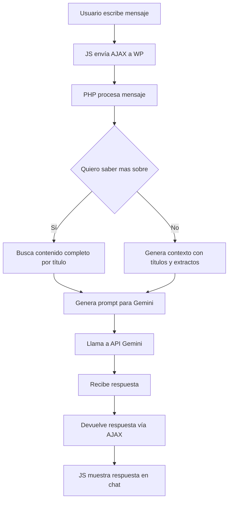

# Gemini Chat

Chat conversacional para WordPress basado en Gemini 2.5 Flash, limitado al contenido del sitio web.

---

## Índice

1. [Descripción General](#descripción-general)
2. [Estructura de Archivos](#estructura-de-archivos)
3. [Instalación y Activación](#instalación-y-activación)
4. [Flujo de Funcionamiento](#flujo-de-funcionamiento)
5. [Explicación de Componentes](#explicación-de-componentes)
    - [PHP (Backend)](#a-php-backend)
    - [JavaScript (Frontend)](#b-javascript-frontend)
    - [CSS (Estilos)](#c-css-estilos)
6. [Personalización y Extensión](#personalización-y-extensión)
7. [Seguridad](#seguridad)
8. [Consideraciones y Buenas Prácticas](#consideraciones-y-buenas-prácticas)
9. [Ejemplo de Extensión](#ejemplo-de-extensión)
10. [Diagrama de Flujo](#diagrama-de-flujo)

---

## 1. Descripción General

**Gemini Chat** es un plugin de WordPress que añade un chat conversacional en la web, utilizando la API de Gemini 2.5 Flash. El chat responde únicamente sobre el contenido publicado en el sitio (posts y páginas). El usuario puede hacer preguntas generales o pedir información detallada sobre un título específico.

---

## 2. Estructura de Archivos

```
gemini-chat/
│
├── assets/
│   ├── chat.css      # Estilos del chat
│   ├── chat.js       # Lógica frontend (interfaz y AJAX)
│   └── chat-icon.png # Icono del bocadillo flotante
│
├── gemini-chat.php   # Lógica principal del plugin (backend)
└── README.md         # Documentación técnica
```

---

## 3. Instalación y Activación

1. **Clona o copia** la carpeta `gemini-chat` en el directorio `wp-content/plugins/` de tu instalación de WordPress.
2. Asegúrate de que los archivos `chat.css`, `chat.js` y `chat-icon.png` estén dentro de la carpeta `assets/`.
3. Ve al panel de administración de WordPress > Plugins y activa "Gemini Chat".
4. (Opcional) Cambia la clave de API de Gemini en `gemini-chat.php` por la tuya propia:

```php
$api_key = 'TU_API_KEY_AQUI';
```

---

## 4. Flujo de Funcionamiento

1. **Carga de recursos:** El plugin inyecta los archivos CSS y JS necesarios en el frontend.
2. **Interfaz de usuario:** Se muestra un bocadillo flotante. Al hacer clic, aparece la ventana de chat.
3. **Envío de mensajes:** El usuario escribe una pregunta y la envía.
4. **AJAX:** El mensaje se envía vía AJAX a WordPress, que lo procesa en el backend.
5. **Procesamiento:** El backend genera un prompt para la API de Gemini, usando el contenido del sitio.
6. **Respuesta:** La respuesta de Gemini se devuelve al frontend y se muestra en el chat, renderizada como Markdown.

---

## 5. Explicación de Componentes

### A. PHP (Backend)

- **Carga de scripts y estilos:**  
  Usa `wp_enqueue_scripts` para incluir los archivos necesarios y pasa variables a JS con `wp_localize_script`.

- **Interfaz HTML:**  
  Inyecta el HTML del bocadillo y la ventana de chat en el footer usando `wp_footer`.

- **AJAX:**  
  Define el endpoint `gemini_chat_ask` para procesar las preguntas del usuario.  
  - Si el usuario pide "saber más sobre [título]", busca el contenido completo de ese post/página.
  - Si la pregunta es general, genera un contexto con títulos y extractos de todo el sitio.

- **Funciones auxiliares:**
  - `gemini_chat_get_site_context($all)`: Obtiene títulos y extractos de posts/páginas.
  - `gemini_chat_get_post_content_by_title($titulo)`: Busca el contenido completo de un post/página por título.
  - `gemini_chat_call_gemini($prompt)`: Llama a la API de Gemini y devuelve la respuesta.

### B. JavaScript (Frontend)

- **Interfaz:**  
  Controla la apertura/cierre del chat y el envío de mensajes.
- **AJAX:**  
  Envía el mensaje del usuario al backend y muestra la respuesta.
- **Markdown:**  
  Si está disponible, usa `marked.js` para renderizar la respuesta en formato Markdown.

### C. CSS (Estilos)

- **Estilos modernos y responsivos** para el bocadillo, ventana de chat, mensajes y contenido Markdown.

---

## 6. Personalización y Extensión

- **Cambiar el modelo o la API:**  
  Modifica la función `gemini_chat_call_gemini` en el PHP.
- **Agregar validaciones o filtros:**  
  Puedes añadir lógica en la función `gemini_chat_ask`.
- **Modificar la interfaz:**  
  Edita el HTML en el hook `wp_footer` y los archivos CSS/JS en `assets/`.
- **Internacionalización:**  
  Usa funciones de traducción de WordPress (`__()`, `_e()`) para textos fijos.

---

## 7. Seguridad

- **Nonce:**  
  Se usa un nonce para proteger el endpoint AJAX.
- **Sanitización:**  
  El mensaje del usuario se limpia con `sanitize_text_field`.
- **Acceso restringido:**  
  El archivo PHP principal verifica que se acceda desde WordPress (`defined('ABSPATH')`).
- **No expongas la API Key en producción:**  
  Usa variables de entorno o el sistema de opciones de WordPress para mayor seguridad.

---

## 8. Consideraciones y Buenas Prácticas

- **Limita el acceso a la API:**  
  Considera agregar límites de uso o validaciones adicionales.
- **Actualiza las dependencias:**  
  Si usas librerías externas (como `marked.js`), mantenlas actualizadas.
- **Accesibilidad:**  
  Mejora la accesibilidad del chat para usuarios con discapacidad.
- **Pruebas:**  
  Realiza pruebas en diferentes navegadores y dispositivos.

---

## 9. Ejemplo de Extensión

**Agregar soporte para Custom Post Types:**

Modifica la función `gemini_chat_get_site_context` para incluir otros tipos de contenido:

```php
'post_type' => ['post', 'page', 'mi_custom_post_type'],
```

**Ejemplo de validación adicional en el backend:**

```php
if (strlen($user_message) > 500) {
    wp_send_json_error('El mensaje es demasiado largo.');
}
```

---

## 10. Diagrama de Flujo



---

## 11. Ejemplo de Uso

1. El usuario ve el bocadillo flotante en la web.
2. Hace clic y se abre la ventana de chat.
3. Escribe: `¿Qué servicios ofrece esta web?`
4. El bot responde sugiriendo el título más relevante.
5. El usuario escribe: `Quiero saber más sobre Servicios`.
6. El bot responde con el contenido completo de la página "Servicios".

---

## 12. Créditos y Licencia

Desarrollado por: Santiago Castellano

Licencia: MIT

---

## 13. Contacto y Soporte

Para soporte, sugerencias o reportar bugs, contacta a: [santiago.castellano@maresalogistica.com] 