# Gemini Chat

Chat conversacional para WordPress basado en Gemini 2.5 Flash, limitado al contenido del sitio web.

---

## Índice

1. [Descripción General](#descripción-general)
2. [Estructura de Archivos](#estructura-de-archivos)
3. [Instalación y Activación](#instalación-y-activación)
4. [Flujo de Funcionamiento](#flujo-de-funcionamiento)
5. [Explicación de Componentes](#explicación-de-componentes)
    - [PHP (Backend)](#a-php-backend)
    - [JavaScript (Frontend)](#b-javascript-frontend)
    - [CSS (Estilos)](#c-css-estilos)
6. [Personalización y Extensión](#personalización-y-extensión)
7. [Seguridad](#seguridad)
8. [Consideraciones y Buenas Prácticas](#consideraciones-y-buenas-prácticas)
9. [Ejemplo de Extensión](#ejemplo-de-extensión)
10. [Diagrama de Flujo](#diagrama-de-flujo)

---

## 1. Descripción General

**Gemini Chat** es un plugin de WordPress que añade un chat conversacional en la web, utilizando la API de Gemini 2.5 Flash. El chat responde únicamente sobre el contenido publicado en el sitio (posts y páginas). El usuario puede hacer preguntas generales o pedir información detallada sobre un título específico.

---

## 2. Estructura de Archivos

```
gemini-chat/
│
├── assets/
│   ├── chat.css      # Estilos del chat
│   ├── chat.js       # Lógica frontend (interfaz y AJAX)
│   └── chat-icon.png # Icono del bocadillo flotante
│
├── gemini-chat.php   # Lógica principal del plugin (backend)
└── README.md         # Documentación técnica
```

---

## 3. Instalación y Activación

1. **Clona o copia** la carpeta `gemini-chat` en el directorio `wp-content/plugins/` de tu instalación de WordPress.
2. Asegúrate de que los archivos `chat.css`, `chat.js` y `chat-icon.png` estén dentro de la carpeta `assets/`.
3. Ve al panel de administración de WordPress > Plugins y activa "Gemini Chat".
4. (Opcional) Cambia la clave de API de Gemini en `gemini-chat.php` por la tuya propia:

```php
$api_key = 'TU_API_KEY_AQUI';
```

---

## 4. Flujo de Funcionamiento

1. **Carga de recursos:** El plugin inyecta los archivos CSS y JS necesarios en el frontend.
2. **Interfaz de usuario:** Se muestra un bocadillo flotante. Al hacer clic, aparece la ventana de chat.
3. **Envío de mensajes:** El usuario escribe una pregunta y la envía.
4. **AJAX:** El mensaje se envía vía AJAX a WordPress, que lo procesa en el backend.
5. **Procesamiento:** El backend genera un prompt para la API de Gemini, usando el contenido del sitio.
6. **Respuesta:** La respuesta de Gemini se devuelve al frontend y se muestra en el chat, renderizada como Markdown.

---

## 5. Explicación de Componentes

### A. PHP (Backend)

- **Carga de scripts y estilos:**  
  Usa `wp_enqueue_scripts` para incluir los archivos necesarios y pasa variables a JS con `wp_localize_script`.

- **Interfaz HTML:**  
  Inyecta el HTML del bocadillo y la ventana de chat en el footer usando `wp_footer`.

- **AJAX:**  
  Define el endpoint `gemini_chat_ask` para procesar las preguntas del usuario.  
  - Si el usuario pide "saber más sobre [título]", busca el contenido completo de ese post/página.
  - Si la pregunta es general, genera un contexto con títulos y extractos de todo el sitio.

- **Funciones auxiliares:**
  - `gemini_chat_get_site_context($all)`: Obtiene títulos y extractos de posts/páginas.
  - `gemini_chat_get_post_content_by_title($titulo)`: Busca el contenido completo de un post/página por título.
  - `gemini_chat_call_gemini($prompt)`: Llama a la API de Gemini y devuelve la respuesta.

### B. JavaScript (Frontend)

- **Interfaz:**  
  Controla la apertura/cierre del chat y el envío de mensajes.
- **AJAX:**  
  Envía el mensaje del usuario al backend y muestra la respuesta.
- **Markdown:**  
  Si está disponible, usa `marked.js` para renderizar la respuesta en formato Markdown.

### C. CSS (Estilos)

- **Estilos modernos y responsivos** para el bocadillo, ventana de chat, mensajes y contenido Markdown.

---

## 6. Personalización y Extensión

- **Cambiar el modelo o la API:**  
  Modifica la función `gemini_chat_call_gemini` en el PHP.
- **Agregar validaciones o filtros:**  
  Puedes añadir lógica en la función `gemini_chat_ask`.
- **Modificar la interfaz:**  
  Edita el HTML en el hook `wp_footer` y los archivos CSS/JS en `assets/`.
- **Internacionalización:**  
  Usa funciones de traducción de WordPress (`__()`, `_e()`) para textos fijos.

---

## 7. Seguridad

- **Nonce:**  
  Se usa un nonce para proteger el endpoint AJAX.
- **Sanitización:**  
  El mensaje del usuario se limpia con `sanitize_text_field`.
- **Acceso restringido:**  
  El archivo PHP principal verifica que se acceda desde WordPress (`defined('ABSPATH')`).
- **No expongas la API Key en producción:**  
  Usa variables de entorno o el sistema de opciones de WordPress para mayor seguridad.

---

## 8. Consideraciones y Buenas Prácticas

- **Limita el acceso a la API:**  
  Considera agregar límites de uso o validaciones adicionales.
- **Actualiza las dependencias:**  
  Si usas librerías externas (como `marked.js`), mantenlas actualizadas.
- **Accesibilidad:**  
  Mejora la accesibilidad del chat para usuarios con discapacidad.
- **Pruebas:**  
  Realiza pruebas en diferentes navegadores y dispositivos.

---

## 9. Ejemplo de Extensión

**Agregar soporte para Custom Post Types:**

Modifica la función `gemini_chat_get_site_context` para incluir otros tipos de contenido:

```php
'post_type' => ['post', 'page', 'mi_custom_post_type'],
```

**Ejemplo de validación adicional en el backend:**

```php
if (strlen($user_message) > 500) {
    wp_send_json_error('El mensaje es demasiado largo.');
}
```

---

## 10. Diagrama de Flujo


---

## 11. Ejemplo de Uso

1. El usuario ve el bocadillo flotante en la web.
2. Hace clic y se abre la ventana de chat.
3. Escribe: `¿Qué servicios ofrece esta web?`
4. El bot responde sugiriendo el título más relevante.
5. El usuario escribe: `Quiero saber más sobre Servicios`.
6. El bot responde con el contenido completo de la página "Servicios".

---

## 12. Créditos y Licencia

Desarrollado por: Santiago Castellano

Licencia: MIT

---

## 13. Contacto y Soporte

Para soporte, sugerencias o reportar bugs, contacta a: [santiago.castellano@maresalogistica.com] 

---

# Gemini Chat (English Version)

Conversational chat for WordPress based on Gemini 2.5 Flash, limited to the website's content.

---

## Index

1. [General Description](#general-description)
2. [File Structure](#file-structure)
3. [Installation and Activation](#installation-and-activation)
4. [Workflow](#workflow)
5. [Component Explanation](#component-explanation)
    - [PHP (Backend)](#a-php-backend)
    - [JavaScript (Frontend)](#b-javascript-frontend)
    - [CSS (Styles)](#c-css-styles)
6. [Customization and Extension](#customization-and-extension)
7. [Security](#security)
8. [Considerations and Best Practices](#considerations-and-best-practices)
9. [Extension Example](#extension-example)
10. [Flow Diagram](#flow-diagram)
11. [Usage Example](#usage-example)
12. [Credits and License](#credits-and-license)
13. [Contact and Support](#contact-and-support)

---

## 1. General Description

**Gemini Chat** is a WordPress plugin that adds a conversational chat to your website, using the Gemini 2.5 Flash API. The chat only responds about the content published on the site (posts and pages). Users can ask general questions or request detailed information about a specific title.

---

## 2. File Structure

```
gemini-chat/
│
├── assets/
│   ├── chat.css      # Chat styles
│   ├── chat.js       # Frontend logic (UI and AJAX)
│   └── chat-icon.png # Floating bubble icon
│
├── gemini-chat.php   # Main plugin logic (backend)
└── README.md         # Technical documentation
```

---

## 3. Installation and Activation

1. **Clone or copy** the `gemini-chat` folder into your WordPress installation's `wp-content/plugins/` directory.
2. Make sure the files `chat.css`, `chat.js`, and `chat-icon.png` are inside the `assets/` folder.
3. Go to the WordPress admin panel > Plugins and activate "Gemini Chat".
4. (Optional) Change the Gemini API key in `gemini-chat.php` to your own:

```php
$api_key = 'YOUR_API_KEY_HERE';
```

---

## 4. Workflow

1. **Resource loading:** The plugin injects the necessary CSS and JS files into the frontend.
2. **User interface:** A floating bubble is displayed. Clicking it opens the chat window.
3. **Message sending:** The user writes a question and sends it.
4. **AJAX:** The message is sent via AJAX to WordPress, which processes it in the backend.
5. **Processing:** The backend generates a prompt for the Gemini API, using the site's content.
6. **Response:** Gemini's response is returned to the frontend and displayed in the chat, rendered as Markdown.

---

## 5. Component Explanation

### A. PHP (Backend)

- **Script and style loading:**  
  Uses `wp_enqueue_scripts` to include the necessary files and passes variables to JS with `wp_localize_script`.

- **HTML interface:**  
  Injects the HTML for the bubble and chat window into the footer using `wp_footer`.

- **AJAX:**  
  Defines the `gemini_chat_ask` endpoint to process user questions.  
  - If the user asks "know more about [title]", it fetches the full content of that post/page.
  - If the question is general, it generates a context with titles and excerpts from the whole site.

- **Helper functions:**
  - `gemini_chat_get_site_context($all)`: Gets titles and excerpts from posts/pages.
  - `gemini_chat_get_post_content_by_title($title)`: Searches for the full content of a post/page by title.
  - `gemini_chat_call_gemini($prompt)`: Calls the Gemini API and returns the response.

### B. JavaScript (Frontend)

- **Interface:**  
  Controls opening/closing the chat and sending messages.
- **AJAX:**  
  Sends the user's message to the backend and displays the response.
- **Markdown:**  
  If available, uses `marked.js` to render the response in Markdown format.

### C. CSS (Styles)

- **Modern and responsive styles** for the bubble, chat window, messages, and Markdown content.

---

## 6. Customization and Extension

- **Change the model or API:**  
  Modify the `gemini_chat_call_gemini` function in PHP.
- **Add validations or filters:**  
  You can add logic in the `gemini_chat_ask` function.
- **Modify the interface:**  
  Edit the HTML in the `wp_footer` hook and the CSS/JS files in `assets/`.
- **Internationalization:**  
  Use WordPress translation functions (`__()`, `_e()`) for static texts.

---

## 7. Security

- **Nonce:**  
  A nonce is used to protect the AJAX endpoint.
- **Sanitization:**  
  The user's message is sanitized with `sanitize_text_field`.
- **Restricted access:**  
  The main PHP file checks for WordPress access (`defined('ABSPATH')`).
- **Do not expose the API Key in production:**  
  Use environment variables or WordPress options for better security.

---

## 8. Considerations and Best Practices

- **Limit API access:**  
  Consider adding usage limits or additional validations.
- **Update dependencies:**  
  If you use external libraries (like `marked.js`), keep them updated.
- **Accessibility:**  
  Improve chat accessibility for users with disabilities.
- **Testing:**  
  Test on different browsers and devices.

---

## 9. Extension Example

**Add support for Custom Post Types:**

Modify the `gemini_chat_get_site_context` function to include other content types:

```php
'post_type' => ['post', 'page', 'my_custom_post_type'],
```

**Example of additional validation in the backend:**

```php
if (strlen($user_message) > 500) {
    wp_send_json_error('The message is too long.');
}
```

---

## 10. Flow Diagram

```mermaid
graph TD;
    A[User writes message] --> B[JS sends AJAX to WP]
    B --> C[PHP processes message]
    C --> D{Know more about}
    D -- Yes --> E[Fetch full content by title]
    D -- No --> F[Generate context with titles and excerpts]
    E --> G[Generate prompt for Gemini]
    F --> G
    G --> H[Call Gemini API]
    H --> I[Receive response]
    I --> J[Return response via AJAX]
    J --> K[JS shows response in chat]
```



---

## 11. Usage Example

1. The user sees the floating bubble on the website.
2. Clicks and the chat window opens.
3. Writes: `What services does this website offer?`
4. The bot responds suggesting the most relevant title.
5. The user writes: `I want to know more about Services.`
6. The bot responds with the full content of the "Services" page.

---

## 12. Credits and License

Developed by: Santiago Castellano

License: MIT

---

## 13. Contact and Support

For support, suggestions or to report bugs, contact: [santiago.castellano@maresalogistica.com] 